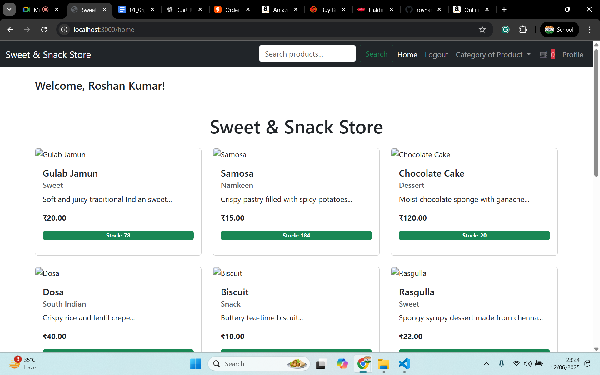
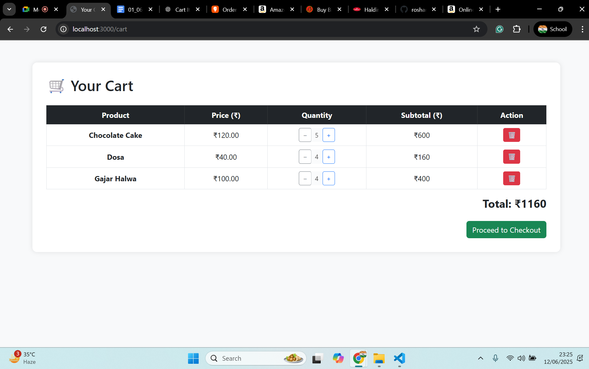
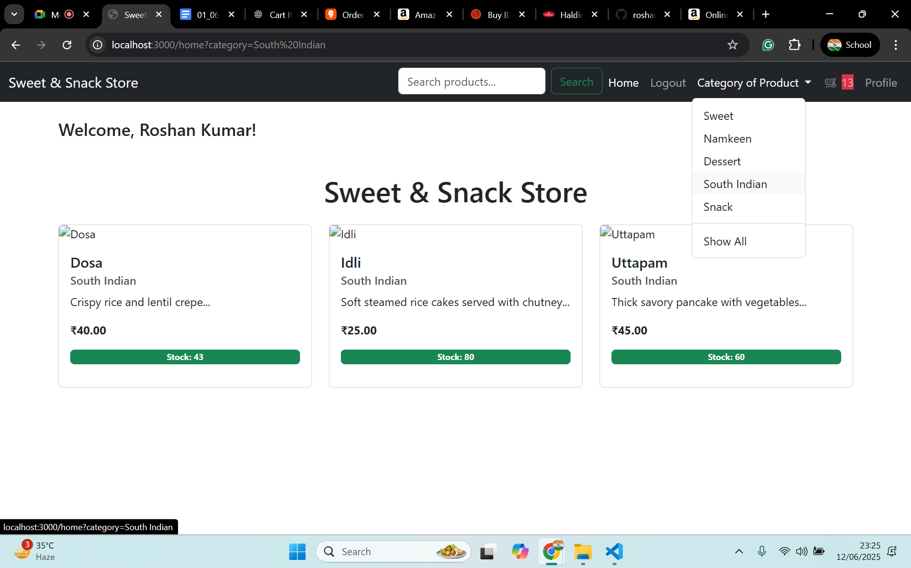

# 🧁 BakeryShopPrototype

A full-stack prototype for a modern bakery shop web application using **Node.js**, **Express.js**, **EJS**, **MySQL**, and **Bootstrap 5**.  
This project simulates an online storefront with essential features such as product listings, category filters, cart management, and user session handling.

---

## 🚀 Features

- 🔐 User authentication (session-based login)
- 🧺 Add to Cart & update item quantity
- 📂 Browse products by category (e.g., Namkeen, Sweets, Bakery)
- 🛍️ Checkout page simulation
- 🖼️ Responsive front-end with Bootstrap 5
- ⚙️ Modular code structure with Sequelize ORM for database interactions

---

## 📸 Screenshots

| Home Page | Cart Page | Category Filter |
|-----------|-----------|-----------------|
|  |  |  |

---

## 🏗️ Tech Stack

- **Frontend**: HTML, CSS, EJS, Bootstrap
- **Backend**: Node.js, Express.js
- **Database**: MySQL + Sequelize ORM
- **Session Management**: Express-session

---

## 📦 Installation

### Prerequisites

- Node.js and npm installed
- MySQL server running locally
- Git

### Steps

1. **Clone the repository**
   ```bash
   git clone https://github.com/your-username/BakeryShopPrototype.git
   cd BakeryShopPrototype


Some modules to download before running the project

1. npm init -y      (that is already in the git repo, but prefer to run this code and make sure to install Node.js)
2. npm install express sequelize mysql2 ejs express-session body-parser                  
